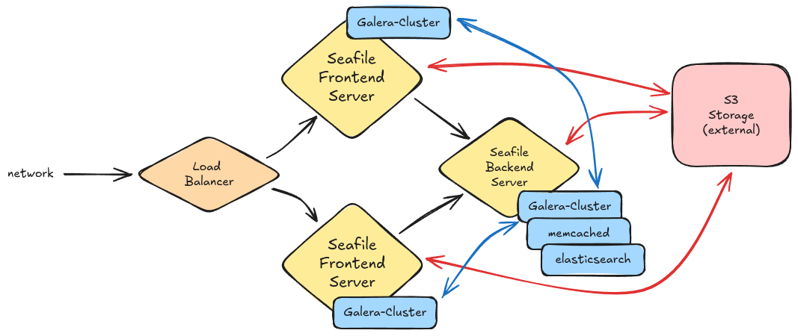

# Installing a Seafile Cluster with Docker

A Seafile cluster is typically composed of three servers, each fulfilling specific roles to ensure efficient operation. The cluster setup includes a **backend server** dedicated to non-time-critical tasks such as file indexing, antivirus scanning, and email notifications. This server also runs essential services like **Memcached** and **Elasticsearch**.

In addition to the backend server, the cluster requires two or more **frontend servers** to handle user requests.

Seafile relies on a SQL database, so we deploy a **Galera cluster** in active-active mode across all servers. For data storage, we recommend using **S3 storage**, which we assume to be external. We also assume that you have a load balancer available.

## Cluster Components

=== "Backend Server"

    The backend server runs the following Docker containers:

    - Seafile
    - MariaDB (Galera)
    - Memcached
    - Elasticsearch

    **Hardware Recommendations:** At least 4 CPUs and 8 GB of RAM.

=== "Frontend Servers"

    Each frontend server runs:

    - Seafile
    - MariaDB (Galera)

    **Hardware Recommendations:** At least 2 CPUs and 4 GB of RAM.

This setup is well-suited for handling up to several hundred users. If your frontend servers experience resource limitations, consider adding additional frontend servers. If the backend server becomes resource-constrained, you can improve performance by adding more CPU and RAM.

!!! warning "Cluster does not automatically mean high-availability"

    While this setup enhances resilience, it does not ensure full high availability. Frontend nodes can fail without affecting the overall operation, but if the backend server fails, some background tasks, such as file indexing and notifications, may be temporarily unavailable. Despite this, Seafile will continue to function in most cases.

    Seafile currently supports **one single backend server**.

Furthermore, it is assumed that the three servers are located on an internal network and can communicate with each other.

## Visualization of the Seafile Cluster



## General Installation Steps

The installation process for all three servers follows similar steps:

- Install Docker runtime.
- Download the yml and .env files.
- Make the necessary modifications to the .env file.
- Start the docker containers.

Sounds easy? It is easy. So let's get started.

## Install basic tools

The following command installs basic tools that are used in the following manual. Usually all these tools are already installed on your linux server.
Execute the following commands on all three servers:

```bash
apt update && \
apt -y install curl pwgen tree wget tar nano
```

## Install Docker and Docker Compose Plugin

At [get.docker.com](https://get.docker.com), you'll find a script designed for the easy and convenient installation of the Docker Engine. While the script isn't recommended for production environments, it has shown no issues in our observations. You can effortlessly install Docker using this single command on all three servers:

```bash
curl -fsSL get.docker.com | bash
```

Alternatively, you can opt to follow [Docker's official installation instructions](https://docs.docker.com/engine/install/)

## Install Seafile Server

This installation assumes that all Seafile components are installed under `/opt`.
We highly recommended to keep this folder structure. All articles in the manual assume Seafile's installation in this directory.

#### 1. Create basic structure

Simply copy and paste the following command into your command line on all three servers to execute. This code will download the latest yml files from repository [:simple-github: seafile-release](https://github.com/datamate-rethink-it/seafile-release).

```bash
mkdir /opt/seafile-compose && \
cd /opt/seafile-compose && \
wget -c https://github.com/datamate-rethink-it/seafile-release/releases/latest/download/seafile-compose.tar.gz \
-O - | tar -xz -C /opt/seafile-compose && \
cp -n .env-release .env
```

#### 2. Create some directories

Elastisearch does not run as root user and therefore it is necessary to create the directory for the volume mount upfront. Otherwise elasticsearch has no permission to write into this directory. Also Galera requires a directory with the right permissions.

=== "Backend Server"

    ```bash
    mkdir -p /opt/seafile-elasticsearch/data && \
    chown -R 1000 /opt/seafile-elasticsearch

    mkdir -p /opt/seafile-galera/mariadb && \
    chown 1001 /opt/seafile-galera/mariadb
    ```

=== "Frontend Servers"

    ```bash
    mkdir -p /opt/seafile-galera/mariadb && \
    chown 1001 /opt/seafile-galera/mariadb
    ```

#### 3. Generate some secrets

Seafile is configured with the hidden `.env` file (=enviroment configuration file) that is stored in the folder `/opt/seafile-compose`.

We utilize `pwgen` to create secure passwords for your _admin account_, the _database root password_ and other stuff. The following commands will generate such passwords and include them in the `.env'` file.

```bash
# Generate these passwords only once!
# You must use the same passwords on the other servers.
sed -i "s/^SEAFILE_ADMIN_PASSWORD=.*/SEAFILE_ADMIN_PASSWORD=$(pwgen 40 1)/" .env
sed -i "s/^SEAFILE_MYSQL_ROOT_PASSWORD=.*/SEAFILE_MYSQL_ROOT_PASSWORD=$(pwgen 40 1)/" .env
sed -i "s/^SEAHUB__SECRET_KEY=.*/SEAHUB__SECRET_KEY=$(pwgen 40 1)/" .env
sed -i "s/^SEAFILE__notification__jwt_private_key=.*/SEAFILE__notification__jwt_private_key=$(pwgen 40 1)/" .env
```

!!! danger "Consistent Secrets Across All Servers"

    Do not generate new secrets for each server. Seafile requires the same secrets to be used on all servers.

#### 4. Complete settings in the .env file

Open the `.env` file with the editor of your choice, like `nano` or `vim` and complete the configuration.

```bash
nano /opt/seafile-compose/.env
```

Continue setting up your Seafile server by setting all required variables.

```python
# components to be used
COMPOSE_FILE='caddy.yml,seafile-pe.yml' # (1)!
COMPOSE_PATH_SEPARATOR=','

# system settings
TIME_ZONE='Europe/Berlin' # (2)!

# seafile server base url
SEAFILE_SERVER_HOSTNAME='seafile.example.com' # (3)!

# initial web admin
SEAFILE_ADMIN_EMAIL='me@example.com'
SEAFILE_ADMIN_PASSWORD='topsecret'

# database
SEAFILE_MYSQL_ROOT_PASSWORD='topsecret'

# seahub secret key
SEAHUB__SECRET_KEY='topsecret'

# jwt private key for seafile notification server
SEAFILE__notification__jwt_private_key='topsecret'

#####
## cluster setup
#####

# IP addresses of the three servers in the internal network
NODE_PRIVATE_IP=10.0.0.2 # (10)!
ELASTICSEARCH_HOST=10.0.0.2 # (4)!
MEMCACHED_HOST=10.0.0.2 # (5)!
SEAFILE_CLUSTER_0_IP=10.0.0.2 # (6)!
SEAFILE_CLUSTER_1_IP=10.0.0.3 # (7)!
SEAFILE_CLUSTER_2_IP=10.0.0.4 # (8)!

# replace 0 with 1 or 2 on the frontend-nodes
NODE_PRIVATE_HOSTNAME='seafile-cluster-0'

## Galera Cluster (Backend config)
MARIADB_GALERA_CLUSTER_BOOTSTRAP='yes' # (9)!
MARIADB_GALERA_CLUSTER_NAME='seafile-galera-cluster'
MARIADB_GALERA_MARIABACKUP_USER='maria_backup_user'
MARIADB_GALERA_MARIABACKUP_PASSWORD='topsecret'
MARIADB_ROOT_PASSWORD='topsecret'
MARIADB_REPLICATION_PASSWORD='topsecret'
MARIADB_REPLICATION_USER='maria_replication_user'
MARIADB_ENABLE_TLS='no'

# cluster definition node name
SEAFILE_CLUSTER_0_NAME='seafile-cluster-0'
SEAFILE_CLUSTER_1_NAME='seafile-cluster-1'
SEAFILE_CLUSTER_2_NAME='seafile-cluster-2'
```

1.  COMPOSE_FILE is a comma separated list **without spaces**. This list defines which components should run on this server. Leave `caddy.yml` and `seatable-server.yml` at the beginning. You will add more components at a later time.
2.  Get a [list of timezones](https://en.wikipedia.org/wiki/List_of_tz_database_time_zones) from Wikipedia.
3.  Select your domain or subdomain that points to your Server (without https://). You have to set an A-Record or CNAME pointing to your IP.
    <br>If you don't have an URL and want to use an IP, then use the free service nip.io and add your-ip.nip.io (e.g. 5.35.28.112.nip.io).
4.  Add the **private IP address** of your elasticsearch host (=the backend server ip)
5.  Add the **private IP address** of your memcached host (=the backend server ip)
6.  Add the **private IP address** of seafile-backend
7.  Add the **private IP address** of your first frontend server
8.  Add the **private IP address** of your second frontend server
9.  This value has to be "yes" on the backend server and "no" on the frontend servers.
10. Add the **private IP address** of this server.

#### 5. Get a license

We assume that you have a license and that you save it to `/opt/seafile-compose/seafile-license.txt` on all three servers.

If you don't have a license, then just create an empty license file with this command.

```bash
touch /opt/seafile-compose/seafile-license.txt
```

!!! warning "Seafile Enterprise requires a license to start"

    Seafile use for up to three users is free. If you enjoy Seafile and are contemplating a larger license, [please get in touch with us](mailto:seafile@datamate.org).

#### 6. Start the backend server

Now it is time to run the following command to download and initiate the docker images for the initial setup **on the backend server**. This process will require some time.

We start with the backend server to initialize the database cluster.

```bash
docker compose up -d
```

#### 7. Start the frontend servers

Now it is time to start also the frontend nodes.

```bash
docker compose up -d
```

#### 8. Load Balancer

Now the frontend nodes should provide their services on port 80. Target the load balancer to these servers and you should be read to go...

If the process completed successfully, you can now open your web browser and access Seafile using the URL you specified in your `.env` file.
Sign in using the credentials you provided in the same file.

:partying_face: **Congratulations!** You've completed the basic setup of your Seafile Server.

#### 9. Next steps

For sure you will do some more configurations or install additional components. Jump to the next chapters to get more information.
