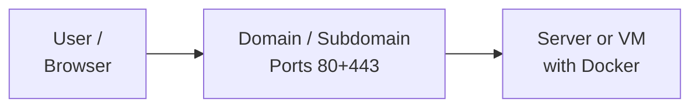

# Requirements

One of the main advantages of Sefaile against other solutions is, that you can run Seafile on your own hardware or on any server your like. Still there are some requirements:

- Linux-Server with Root-Shell
- Public domain pointing to your server
- Open Ports for HTTP and HTTPS access (probably more ports for other components)
- The ports should not be already in use by another proxy such as NGINX or Apache

Does this sounds complicated? Not really. So lets get started.

[Let's begin with the installation in the root-shell](../docker/single-node.md){ .md-button .md-button--primary }

If you need more information, you can get more details in this article.

## Platform support

Seafile uses `docker` and `docker compose`. Therefore it should run as long as docker virtualisation is available. Still we recommend **Debian 11 or newer** because we always use Debian for production and testing.

Currently only x86/x64 architecture is officially supported. Bigger customers might get support with ARM based systems.

## Hardware

Seafile Server requires at least

- 2 CPU cores
- 4 GB RAM
- 50 GB SSD

These resources guarantee good performance for most applications with up to 100 users. More important than a lot of CPU or RAM is a fast storage for the database.

Also be aware that typically you will require a lot of space to store all the files of your users. Next to local storage, seafile supports S3 and network file systems like nfs.

As soon as you have more than 100 users, you should consider adding additional ressources or extending your Seafile Platform to use a cluster.

!!! warning "Additional components need additional ressources"

    These hardware requirements are for Seafile Server. If you install additional components like collabora online or onlyoffice the requirements for these ressources stack up and you have to add additional ressources.

For sure we need a **root shell** on this server to execute the installation commands.

## Public available domain

This manual assumes that you have **one domain or subdomain** that points to your public IP address of your server.

For sure, it is possible to run Seafile without an internet connection (air-gapped) or with custom SSL certificates. This requires additional settings which are explained in separate chapters.

## Ports

SeaTable needs by default only the default ports **80 (HTTP)** and **443 (HTTPS)**.

- **80**: HTTP access is necessary to receive a Let's Encrypt certificate
- **443**: HTTPS is the main entrance to SeaTable Server

## License

**Seafile Professional** requires a license to start. Without a license you can only create up to three users. Licenses with more than three users can be obtained from datamate GmbH & Co. KG. [Just contact us and ask for a quote](mailto:seafile@datamate.org).

**Seafile Community** does not require a license, but is not supported by this deployment.
